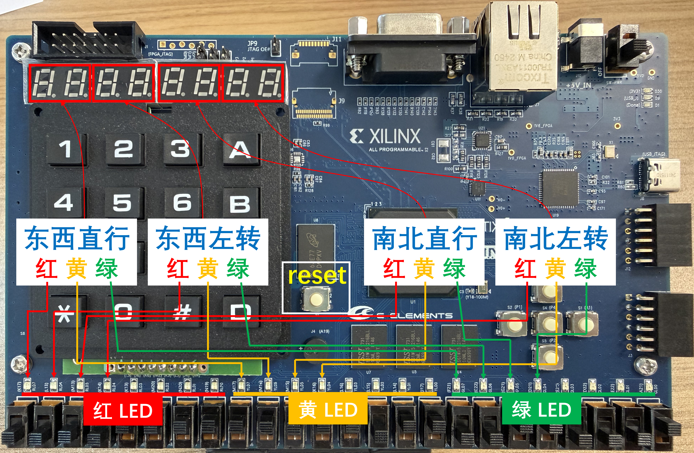

实验三 交通灯有限状态机设计与 FPGA 实现
========================

本实验中，我们将练习有限状态机的设计，实现交通灯控制功能，并最终在FPGA开发板上运行。

1. 交通灯控制功能描述
~~~~~~~~~~~~~~~~~~~~~~~~~~~~~~~~

假设我们要为一个十字路口设计交通灯控制电路，要求如下：

   **道路及车流**

   - 路口有东西向和南北向这两条交叉的道路；
   - 有自西向东、自东向西、自北向南、自南向北四个方向驶入路口的车流。

   .. figure:: ./pics/cross.png
      :alt: cross
      :align: center
      :scale: 30

   **交通灯颜色**

   - 每组交通灯有红、黄、绿三种颜色；
   - 红灯亮时禁止通行，绿灯亮时允许通行，黄灯亮时提示减速。
   
   **直行与左转独立控制**

   - 每个方向驶入的车流设两组交通灯，一组控制直行车流，另一组控制左转车流；
   - 右转车流无特殊控制，只需减速慢行、礼让行人即可。

   **四对交通灯的控制**

   - 共 8 组交通灯，其中对向的交通灯两两相配：颜色相同，且同时亮起；
   - 共有 4 对交通灯需要控制，即：
      东西向直行：自西入路口和自东入路口的直行车流的交通灯相同；

      东西向左转：自西入路口和自东入路口的左转车流的交通灯相同；

      南北向直行：自北入路口和自南入路口的直行车流的交通灯相同；

      南北向左转：自北入路口和自南入路口的左转车流的交通灯相同。

   **通行顺序**

   - 东西向直行 -> 东西向左转 -> 南北向直行 -> 南北向左转 -> 东西向直行 -> ...

   **切换时序要求**

   - 每一组交通灯的三种颜色切换顺序为：红灯 -> 绿灯 -> 黄灯 -> 红灯；
   - 绿灯持续时间按车流量需求设置；
   - 黄灯持续 3 秒；
   - 通行方向切换的间隙，需有 “全红” 阶段持续 2 秒，以避免车辆冲突、确保安全；
   例如，“东西向直行” 切换至 “东西向左转” 时，直行的 3 秒黄灯结束后，红灯亮起，此时左转依然保持红灯，经历 2 秒的 “全红” 阶段，左转绿灯再亮起。

   **倒数计时**

   - 每一组交通灯都有一个数字计时器，显示当前交通灯的倒数秒数；
   - 计时器的倒数秒数应与当前交通灯的颜色对应；
   - 倒数数字不包含 “0”，倒数至 “1” 之后进入下一状态的倒数计时。

2. 实验内容
~~~~~~~~~~~~~~~~~~~~~~~~~~~~~~~~

交通灯有限状态机设计
-------------------------------
从功能描述可以看出交通灯控制逻辑是在有限个状态中切换，因此可以用有限状态机来实现。

.. admonition:: 必做内容1：状态转换图
   :class: mytodo

   请根据第一小节的功能描述，画出交通灯有限状态机的状态转换图。需完整体现每个状态的定义、对应的交通灯颜色及状态切换条件。

   最终将状态转换图附在实验报告中。
   

.. admonition:: 必做内容2：Verilog 代码设计
   :class: mytodo

   根据状态转换图，设计交通灯有限状态机的 Verilog 代码，以下代码框架供参考。
   
   3 位的 light_xx_xx 信号表示三种颜色的交通灯， ``[2:0]`` 位分别代表 ``[红灯亮, 黄灯亮, 绿灯亮]``。
   例如: ``light_east_west_through = 3'b100`` 表示东西直行的红灯亮、黄灯和绿灯熄灭； ``light_south_north_leftturn = 3'b001`` 表示南北左转的绿灯亮、红灯和黄灯熄灭。
   
   8 位的 count_xx_xx 信号表示倒数秒数计时器。
   
   请在代码框架中补充完整有限状态机的设计。

    .. code-block:: v
        :caption: 交通灯有限状态机代码框架
        :linenos:

         module trafficlight_fsm (
            clk         
            ,reset      
            ,light_east_west_through       
            ,light_east_west_leftturn      
            ,light_south_north_through         
            ,light_south_north_leftturn
            ,count_east_west_through
            ,count_east_west_leftturn
            ,count_south_north_through
            ,count_south_north_leftturn       
         );

            input    clk, reset;
            output   light_east_west_through, light_east_west_leftturn,                       
                     light_south_north_through, light_south_north_leftturn;
            output   count_east_west_leftturn, count_east_west_through, 
                     count_south_north_leftturn, count_south_north_through;

            wire    clk, reset;
            reg [2:0]   light_east_west_through, light_east_west_leftturn, 
                        light_south_north_through, light_south_north_leftturn; 
                        // [2:0] represents three colors, eg. [red, yellow, green]
            reg [7:0]   count_east_west_through, count_east_west_leftturn, 
                        count_south_north_through, count_south_north_leftturn;
                        // [7:0] represents the count of seconds for each direction's light

            // Your codes should start from here.
            // ......
            // End of your codes.
               
         endmodule

.. admonition:: 必做内容3：testbench 仿真
   :class: mytodo

   设计 testbench 验证交通灯有限状态机模块的功能。需测试每个状态的切换、计时器的计数功能。为节省仿真时间，可以将交通灯设置为一个时钟周期倒数一个数，而且可以把灯绿灯时间设置成较少个时钟周期，例如 8 个时钟周期，这样 4 对方向的完整周期为 52 个周期。

   截图一个完整周期的仿真波形（如图示例），并附在实验报告中。波形应包含四对交通灯的颜色变化、计时器的计数变化以及状态切换的情况。

   .. figure:: ./pics/simul_result.png
      :alt: simul_result
      :align: center

适应于 FPGA 实现的修改  
------------------------------------------------------
与上次实验相同，上板的代码需要做 **端口对应** 和 **时钟分频** 两处修改。依然采用 1Hz 时钟作为状态机的时钟输入。

本实验中我们将使用板载的 P20 按键作 reset 功能、LED 作为红黄绿三种灯的显示、7 段数码管显示倒数秒数。

与上次实验类似，需要建一个顶层模块（代码示例如下），将有限状态机和板载 LED、数码管连接起来。24 个 LED 的输入由 24 位输出端口 led_out 提供，高电平会使得 LED 亮起。8 个数码管的输入由 seg_out 提供，数码管及其驱动模块与上一次实验中使用的相同。设计约束文件中也需要做相应的设置，这里直接给出约束文件供参考：:download:`light_led.xdc (点击下载) <light_led.xdc>` 。 

.. code-block:: v
   :caption: 交通灯fsm top
   :emphasize-lines: 10, 17
   :linenos:

   module light_top (
      clk     
      ,reset  
      ,led_out 
      ,code   
      ,cs_o  
   );

      input   clk, reset;
      output  led_out;        // out for 24 LED
      output  code, cs_o;

      wire    clk, reset;
      wire [23:0] led_out;
      wire [7:0]  code, cs_o;

      wire [31:0] seg_out;   // out for seg
      wire [2:0]  light_east_west_through, light_east_west_leftturn, 
                  light_south_north_through, light_south_north_leftturn; 
      wire [7:0]  count_east_west_through, count_east_west_leftturn, 
                  count_south_north_through, count_south_north_leftturn;

      trafficlight_fsm u_trafficlight_fsm(
         .clk                            (clk)    
         ,.reset                         (reset)
         ,.light_east_west_through       (light_east_west_through)
         ,.light_east_west_leftturn      (light_east_west_leftturn)
         ,.light_south_north_through     (light_south_north_through)
         ,.light_south_north_leftturn    (light_south_north_leftturn)
         ,.count_east_west_through       (count_east_west_through)
         ,.count_east_west_leftturn      (count_east_west_leftturn)
         ,.count_south_north_through     (count_south_north_through)
         ,.count_south_north_leftturn    (count_south_north_leftturn)
      );
      
      assign led_out = {(light_east_west_through[2]==1), 
                        (light_east_west_leftturn[2]==1),
                        (light_south_north_through[2]==1), 
                        (light_south_north_leftturn[2]==1),
                        4'b0000,
                        (light_east_west_through[1]==1), 
                        (light_east_west_leftturn[1]==1),
                        (light_south_north_through[1]==1), 
                        (light_south_north_leftturn[1]==1),
                        4'b0000,
                        (light_east_west_through[0]==1), 
                        (light_east_west_leftturn[0]==1),
                        (light_south_north_through[0]==1), 
                        (light_south_north_leftturn[0]==1),
                        4'b0000
                     };                
      
      assign seg_out = {count_east_west_through, count_east_west_leftturn, 
                        count_south_north_through, count_south_north_leftturn};
      
      seg_driver u_seg_driver(
         .clk     (clk)
         ,.data   (seg_out)
         ,.reset  (reset)
         ,.code   (code)
         ,.cs_o   (cs_o)
      );

   endmodule

FPGA 演示  
------------------------------------------------------

.. admonition:: 必做内容4：交通灯的 FPGA 实现与演示
   :class: mytodo

   在 FPGA 上实现交通灯的控制功能，并拍摄演示视频。视频必须展示包含四对交通灯变化的完整周期。

.. admonition:: 选做内容：倒数秒数的BCD码显示
   :class: myquestion

   以上给出的 light_top 模块中，数码管显示的是倒数秒数的二进制码，以十六进制显示，如果想要显示为十进制的 BCD 码，需要在顶层模块中增加一个二进制转 BCD 的模块。请自行设计该模块，并将其接入顶层模块中。

3. 报告提交
~~~~~~~~~~~~~~~~~~~~~~~~~~~~~~~~

本次实验需要提交：

   * 实验报告：:download:`下载实验报告模板 <Lab3_Report_26Fall.docx>` 
   * ``.v`` 文件压缩包：包含设计文件和仿真文件
   * 演示视频：录制交通灯工作的演示视频，要求将学生卡放置在镜头内

三项一同扫码提交（支持从微信聊天记录上传）。

.. raw:: html

   
Deadline ：<strong style="color: #d32f2f;">2026-10-18 23:59:59 </strong>。

