实验一 加法器设计
==========================================

本实验中，我们将使用 Verilog 的各种基础语法完成加法器电路设计，并对电路进行仿真以测试电路的功能。

1. 实验准备
~~~~~~~~~~~~~~~~~~~~~~~~~~~~~~~~
Verilog HDL 语言基础
-----------------------------------------------------------------------------
Verilog 是一种用于描述、设计电路的 **硬件描述语言 HDL (Hardware Description Language)** 。理论课堂上已给出一些简单的示例和基本语法的讲解，建议同学们在实验前阅读 “教材附录 A” 熟悉 Verilog 的基本语法。
 

Verilog 仿真器
-----------------------------------------------------------------------------
常见的 Verilog 仿真器有 VCS 、modelsim 、Verilog-XL 、iverilog 、verilator 等。我们使用的是 Xilinx 公司的 FPGA 集成设计环境 Vivado 中的 xsim 仿真器，为我们后续实验中使用 FPGA 教学实验板做准备。

实验室的台式机已安装 Vivado 2018.3 WebPACK 版本。该版本安装体积约 20 GB，比近几年约 100 GB 的版本更轻便，更适合我们的教学需求，且是无需许可证的版本。
Vivado 不同的版本之间功能差异比较小，2015 年之后的版本，基本都能够满足实验需求。

Verilog 代码编写环境
-----------------------------------------------------------------------------
工欲善其事，必先利其器。
一个好的代码 Coding 环境可以使得代码编写更加高效。Vivado 作为一个集成开发环境，当然也集成了代码编辑功能，不过辅助代码编写的各种插件仍然比不过 VC Code 中的丰富。

这里建议使用 ``VS Code`` ， 配合 ``Verilog-HDL/SystemVerilog/Bluespec SystemVerilog`` + ``ctags`` 插件。这两个插件可以为 Verilog 等语言提供基础的高亮和语法框架支持，还可以提供 ``动态语法检查`` 、鼠标悬停查看信号定义、跳转信号和模块等功能。

如果你经常写代码，安装插件对你来说肯定不陌生。你可以在 `这里 <https://dphweb.cn/index.php/2023/08/22/verilog-hdl%e6%8f%92%e4%bb%b6%e9%85%8d%e7%bd%ae%e6%95%99%e7%a8%8b/>`_ 学习配置教程。

2. 实验内容
~~~~~~~~~~~~~~~~~~~~~~~~~~~~~~~~

Verilog 描述全加器 
------------------------------------------------------

我们知道 Verilog 描述电路可以有很多模式：结构级描述、行为级描述等。以下给出一种全加器的 Verilog 实现方式：

.. code-block:: v
   :caption: 全加器 (Full Adder) 的一种 Verilog 实现
   :emphasize-lines: 13
   :linenos:

   module ref_fa (
       a       // <<i<<
      ,b       // <<i<<
      ,cin     // <<i<<
      ,sum     // >>o>>
      ,cout    // >>o>>
   );
      input a, b, cin;
      output sum, cout;
      wire a, b, cin;
      wire sum, cout;

      assign {cout, sum} = a + b + cin;

   endmodule

Verilog 描述超前进位加法器 
------------------------------------------------------

超前进位加法器 (Carry-look-ahead Adder) 是一种进位链延迟更短的加法器，我们已经在理论课上学习了4位超前进位加法器的原理。

.. admonition:: 必做内容1：Verilog 实现4位超前进位加法器
   :class: mytodo

   以下图代码框架为基础，补全4位超前进位加法器的 Verilog实现，并保存为 .v 文件。
   虽然上图中的 "assign {cout, sum} = a + b + cin" 的赋值方式可以只用一行实现4位加法，但无法在具体实现方式上体现 “超前进位”，因此不允许使用这种连续赋值法。

   .. code-block:: v
      :caption: 4位超前进位加法器代码框架
      :emphasize-lines: 9-11
      :linenos:

      module cla_4bit(a, b, cin, sum, cout);

         input a, b, cin;
         output sum, cout;

         wire [3:0] a, b, sum;
         wire cin, cout;

         // Your codes should start from here.

         // End of your codes.

      endmodule

.. raw:: html

   

      
思考：多位加法器的代码实现

      
多位加法器的实现方式有很多，行波进位加法器、选择进位加法器、超前进位加法器、进位旁路加法器等，当然还有此次禁止使用的朴实无华的 + 号运算符实现的加法器，如何判断哪种代码实现更好呢？

   

Testbench 编写 
------------------------------------------------------
如何确定你设计的 Verilog 代码是正确的呢？对代码进行逻辑功能仿真！而用于仿真的代码文件被称为 Testbench 文件。 

Testbench 本身也描述了一个 module ，但是它没有端口，不需要和外界相连。在 这个testbench module 的内部生成一些信号，作为待测试模块（如 ref_fa 模块）的输入，然后观察待测试模块的输出信号是否符合预期。Testbench 也可以使用 $display() 函数打印一些信息，帮助我们判断电路是否正确。

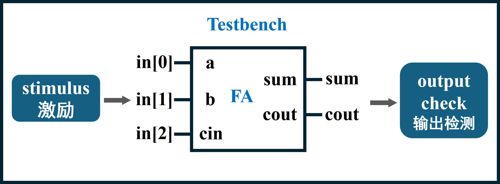

我们从一个简单的全加器 Testbench 入手，了解一下 Testbench 的简单写法。

.. code-block:: v
   :caption: 全加器的简单 Testbench
   :emphasize-lines: 1, 6-12, 21
   :linenos:

   `timescale 1ns/1ps
   module ref_fa_tb ();
      reg [2:0] in;
      wire sum, cout;

      ref_fa u_ref_fa (
          .a       (in[0]) // <<i<<
         ,.b       (in[1]) // <<i<<
         ,.cin     (in[2]) // <<i<<
         ,.sum     (sum)   // >>o>>
         ,.cout    (cout)  // >>o>>
      );

      initial  begin
         in = 3'b0;
         #100;
         for (integer i = 0; i < 8; i = i + 1)  begin
            in = in + 1;
            #100;
         end
         $stop;
      end

   endmodule

回忆一下，在 Logisim 中，你可以把一个画布中的电路块设置输入输出端口，封装成模块，然后在另一个画布中放置这个模块。类似地，在 Verilog 中，你可以在一个模块中使用另一个模块，这就是模块的 **实例化** 。代码中间高亮的一大段，代表在 Testbench 顶层 module 中对 ``ref_fa`` 进行实例化，并指定了哪些信号连接到这个实例的输入输出端口。 例如：ref_fa 中的 a 端口``.a`` 代表 ，对应连接到 ref_fa_tb 中的信号 in[0]。

Testbench 中的模拟了真实电路的运行过程。想象一下如果我们手握一个实体电路，要对它进行测试，势必会先给它一种输入信号的组合，观测输出，再换一种输入组合再观测，依次测完所有必要的输入信号组合。这种 “依次” 测试的过程在 Testbench 中也同样存在，即给输入信号的赋值加上了时间节点。代码第一行的 \`timescale [timeunit]/[timeprecision] 指定了仿真时间的基本单位和时间精度。initial 块中的 ``#100`` 代表延迟 100 个时间单位之后再执行后续语句。 for 循环中遍历所有的输入组合，每种组合维持100 个时间单位。而时间精度代表仿真中两步之间最小的时间间隔，例如：对于 \`timescale 1ns/1ps，initial 块中的 ``#1.1111`` 本应代表延迟 1.1111 ns，但由于精度只能到 1 ps 即 0.001 ns，因此延迟会舍入变成 1.111 ns。

$stop 系统任务会将仿真暂停，暂停后可以手动继续运行仿真。

.. raw:: html

   

         
 Testbench 测试思路

      
4位超前进位加法器的 Testbench 也还是和全加器的 Testbench 一样写法吗？

      
这次的信号数量比较多，一共有 512 种输入组合，如果我们需要依次去看 512 次的波形，然后检查是否符合预期，这看起来太不智能了 ：( 

      
我们可以找到一个能输出正确答案的参考电路 (reference)，再在 Testbench 中让软件对比待测电路 dut (Device Under Test) 和 reference 的结果是否一致，如有不一致就打印出来，不就省事多了？ 

      
 <strong>打印信息可以使用 $display() 函数，Vivado 会将信息显示在下方的 Tcl Console 中。</strong> 使用方法很像大家之前学过的 printf() 函数。 

   

.. raw:: html

   

      
必做内容2：编写 Testbench 

      
参照全加器的 testbench 以及测试思路提示，为4位超前进位加法器编写 Testbench，并保存为 .v 文件。

      
命名规则最好类似于 tb_cla_4bit ，直观地指示出是用于测试什么模块的测试文件。

   

Vivado 中建立工程并仿真
------------------------------------------------------

打开 Vivado 软件，来到 Vivado 软件初始界面，如下图所示：

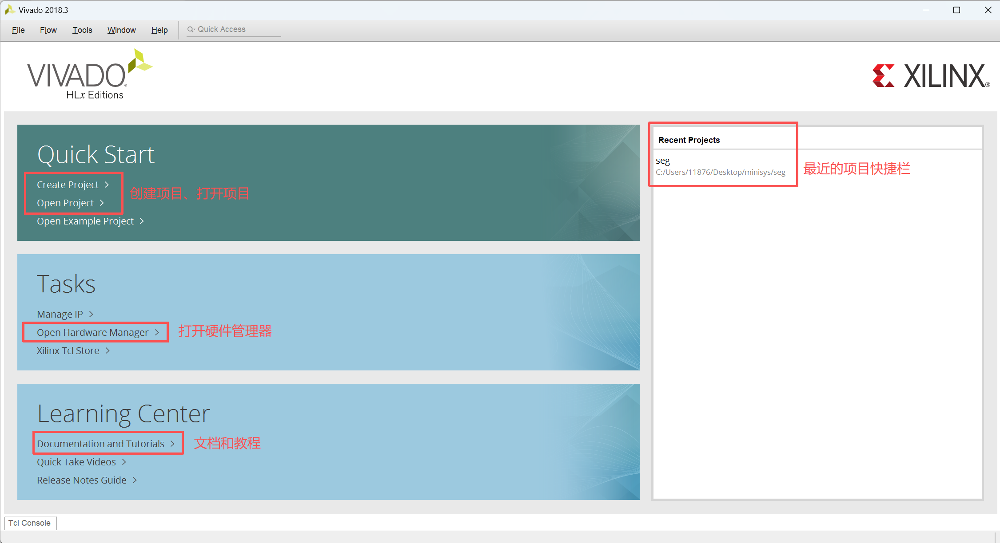

创建一个新 project ，例如取名为 adder ，并保存在合适的位置， **一定要是全英文的路径** 。
勾选 ``Create project subdirectory`` 则会在路径下创建一个以项目名称命名的文件夹，用于存放项目的文件。如果已手动创建了这个文件夹，就不用勾选该选项了。

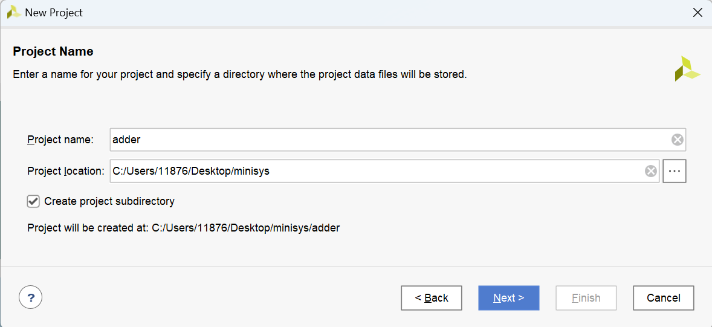

硬件型号选择页面可以选择目标 FPGA 芯片型号， ``Family`` 系列选择 ``Artix-7`` ， ``Package`` 封装方式选择 ``fgg484`` ，
然后选择 ``xc7a100tfgg484`` ，后续的步骤直接 “下一步” 即可。

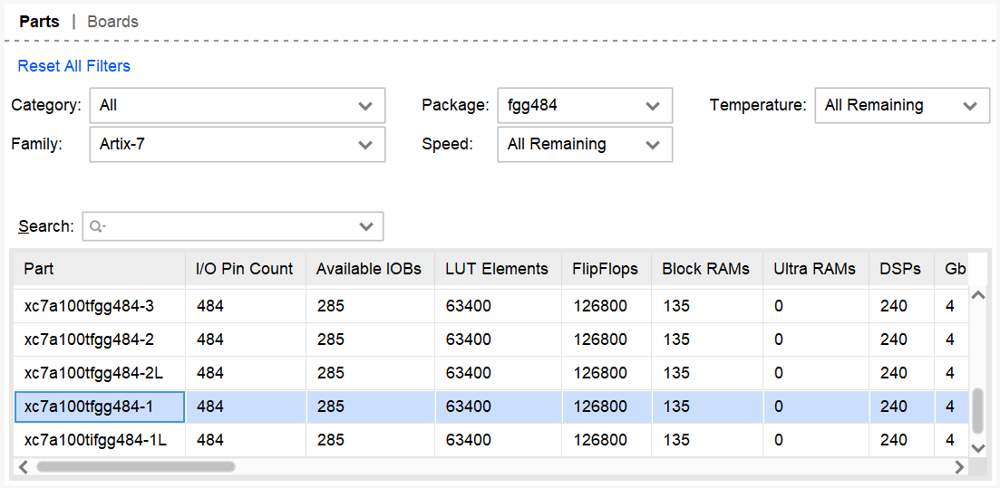

下图是项目初始页面，本次实验内容我们只需要关心红色方框标记出来的区域。
左侧 ``Flow Navigator`` 显示了完整的设计、仿真、实现流程。

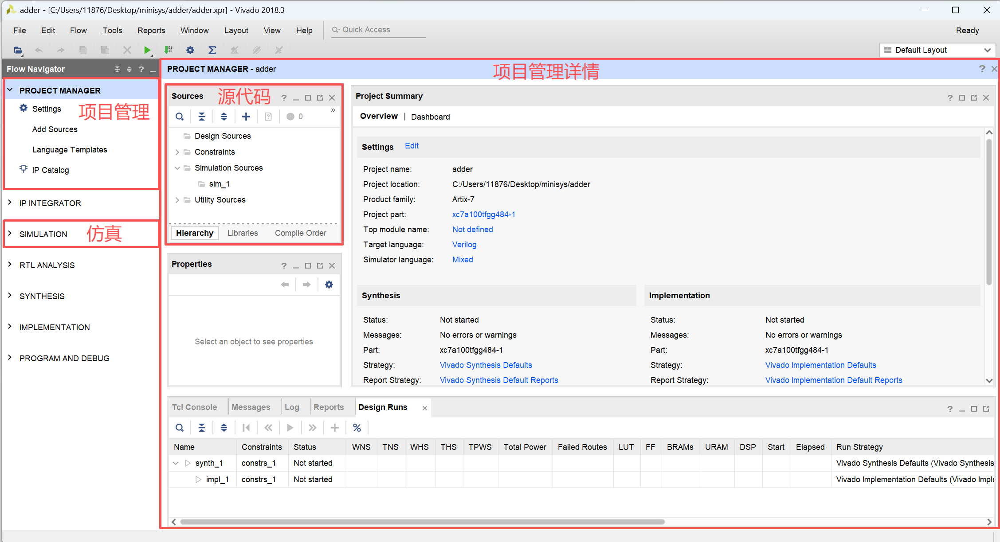

随后需要将编写好的源代码添加到工程中，可以通过下图所示两个地方添加源文件。

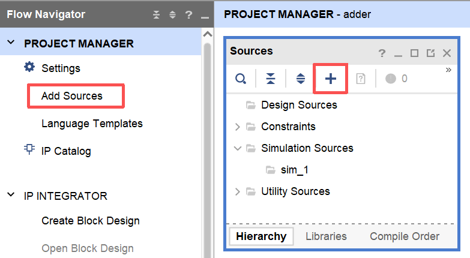

源文件共有三种类型： ``design source`` 设计文件（例如描述电路的 .v 文件）、 ``simulation source`` 仿真文件（例如 Testbench 的 .v 文件），和 ``constraints`` 约束文件。

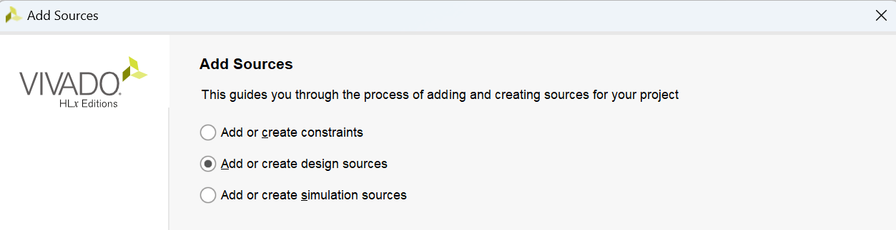

文件添加完成之后，软件会自动更新源代码的层级结构，如下图所示。 顶层文件会自动更新，并被标注了品字形图标。如果你想设置其他文件为顶层文件，可以对源文件右键 ``Set as Top`` 修改为顶层文件。

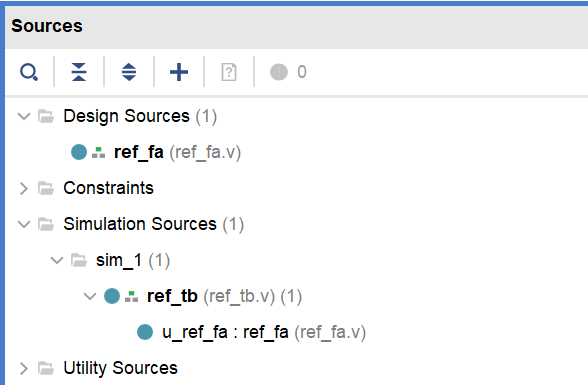

点击 ``Run Behavioral Simulation``，即可进行仿真操作。

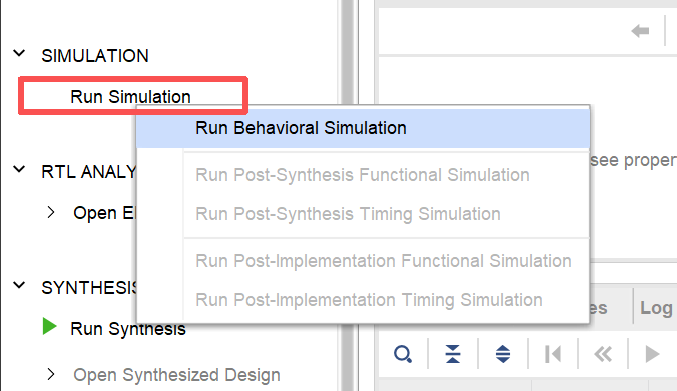

打开仿真界面后，我们可以看到仿真产生的信号波形，如下图所示：
1号红色框标注的播放键按钮用于运行仿真，2号框的图标用于重启仿真。3号框中是模块层级，点击其中的一个模块就可以将此模块包含的信号显示到4号框中。从4号框中可以选择想要观测的信号，使其波形显示在5号框。6号框的两个放大镜按钮可以放大和缩小波形显示范围，7号所指的按钮用于显示完整的仿真波形信号。

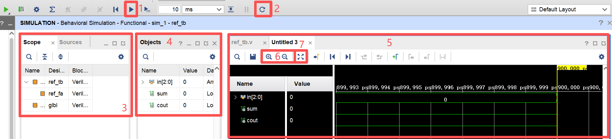

观察波形，可以判断输出信号是否符合预期，即电路工作是否正确。如果你用了 ``$display()`` 或者 ``$monitor()`` 等函数，输出内容会显示在 Vivado 下方的 Tcl Console 中。

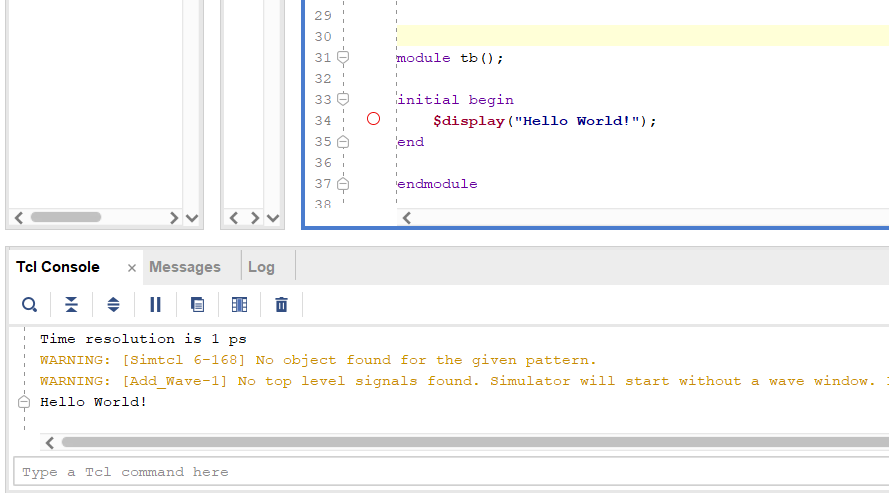

.. raw:: html

   

      
必做内容3：仿真4位超前进位加法器

      
用你写的 Testbench 测试你写的4位 CLA 加法器，并把测试通过的截图附在实验报告中。

      
这个4位超前进位加法器会被用于组成更大位宽的加法器，以及后续的实验中，所以一定要 de 出所有的 bug。

   

层次化超前进位加法器
------------------------

超前进位加法器可以显著提升加法器的性能，但是随着加法器位宽的增加，进位的计算会花费指数级增加的电路开销。因此对于32位、64位等更大位宽的加法器，可以将低位宽的加法器块之间用行波进位等方式连接。

.. raw:: html

   

      
选做内容：16位层次化超前进位加法器

      
我们可以改造一下之前的4位超前进位加法器代码，将 generate 进位生成信号 g 和 propagate 进位传递信号 p 输出，给第二级超前进位电路使用，组成16位层次化超前进位加法器。
   

.. admonition:: 思考：大型加法器的验证
   :class: myquestion

   当电路复杂度上升了，怎么验证呢？例如对于64位的加法器，难道需要将所有的情况都穷举，然后与 reference 比较结果吗？这将一共有 2^64 * 2^64 * 2 种情况，显然不可能。那我们该如何验证呢？

   下图代码给出了一种方案，自己阅读思考一下吧！

   .. code-block:: v
      :caption: 测试激励示例
      :emphasize-lines: 2, 9-12
      :linenos:

      initial  begin
         for (integer i = 0; i < 100000; i = i + 1)  begin
            a = $random;
            b = $random;
            cin = $random;

            #100;

            if ((ref_sum != dut_sum) || (ref_cout != dut_cout))   begin
               $display("Print tests failed information");
               $stop;   // 如果有错误暂停仿真
            end
         end
      end

.. raw:: html

   

      
有错误怎么去 Debug 

      
Bug 是在所难免的，那么遇到错误了，怎么去 Debug 呢？

      
如果电路的信号数量太多了，比如32位加法器，让你觉得根本无从下手，建议你先把小一些的模块，比如16位加法器模块验证正确，而要验证16位加法器又需要确保4位加法器是正确的。

      
所以一个好办法就是采取最中规中矩的方法：<strong>写一个模块验证一个，写一点代码验证一点。</strong>这样可以快速定位大工程中的问题，而不是等写了一千行代码了，再一起验证。

   

3. 报告提交
~~~~~~~~~~~~~~~~~~~~~~~~~~~~~~~~
请点击 `这里 <../files/Lab1_Report_26Fall.docx>`_ 下载实验报告模板。填写完成后，连同 Verilog 代码文件的压缩包，扫码提交（支持从微信聊天记录上传）。

.. raw:: html

   
Deadline ：<strong style="color: #d32f2f;">2026-9-20 23:59:59 前</strong>。

